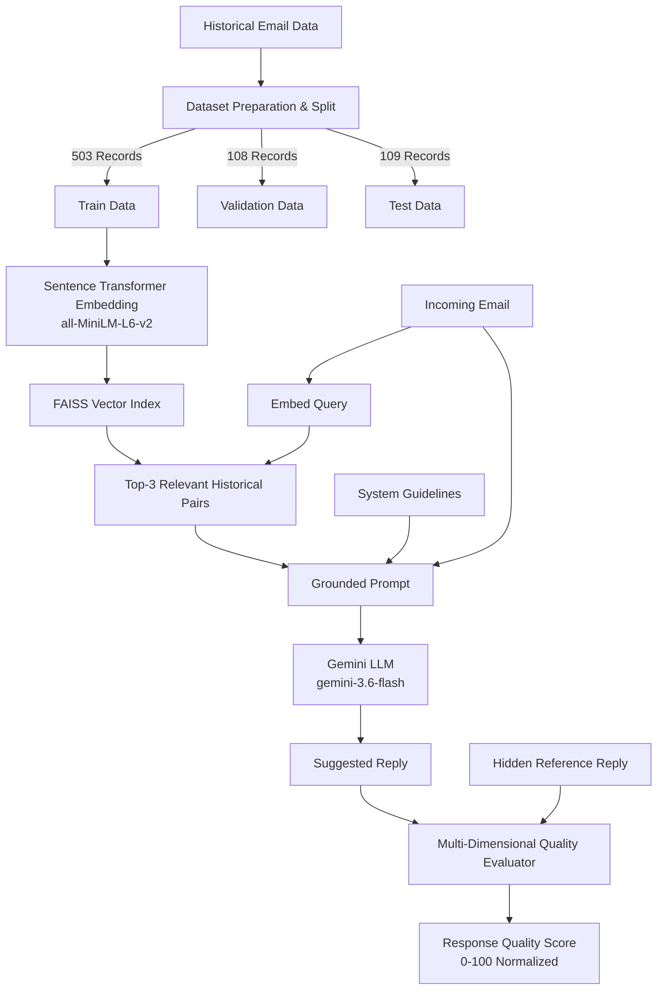

# AI Email Suggested-Response System

A production-ready AI system that generates grounded, context-aware email responses using Retrieval-Augmented Generation (RAG), Google Gemini LLM, and multi-dimensional response quality evaluation.

---

## 1. Project Overview

### Problem Statement
Modern enterprise professionals, university administrators, and customer-support teams receive hundreds of emails daily covering repetitive requests such as meeting scheduling, order status updates, technical troubleshooting, invoice inquiries, and document requests. Manually drafting responses consumes significant operational time and introduces inconsistencies in tone and accuracy.

Classical Machine Learning models can categorize incoming emails into static classes but cannot generate dynamic, context-aware natural language responses. On the other hand, ungrounded Large Language Models (LLMs) often hallucinate nonexistent order numbers, invent wrong dates/times, or fail to follow internal policy guidelines.

### Solution
The **AI Email Suggested-Response System** bridges this gap:
- Takes an incoming email as input and generates a professional suggested reply.
- Grounds LLM generation using historical email–reply pairs retrieved dynamically from a vector index.
- Evaluates every generated response using a multi-dimensional scoring engine across 5 distinct quality axes.
- Exposes REST API endpoints and a responsive, modern Web UI for real-time human interaction.

---

## 2. Hiver Challenge Requirements Matrix

| Requirement | Implementation Summary | Status |
| :--- | :--- | :---: |
| **Own Email Dataset** | 720 structured email–reply pairs across 15 domains with explicit train/val/test splits. | Completed |
| **Gen-AI Response Generation** | Generates dynamic, natural language replies using `gemini-3.6-flash` (or OpenAI). | Completed |
| **Grounding using RAG** | FAISS vector search fetches top-3 historical pairs from `train.json` to ground LLM prompts. | Completed |
| **Evaluation Beyond Exact Match** | Evaluates quality across 5 weighted dimensions (0–100 scale); does NOT use exact match. | Completed |
| **Per-Response Evaluation** | Calculates individual scores, composite score, explanation, strengths, and failure issues. | Completed |
| **Overall Evaluation Benchmark** | Runs benchmark on held-out `test.json` generating JSON, CSV, and Markdown reports. | Completed |
| **Human Validation** | 60 candidate responses annotated on a 1–5 scale in `data/human_annotations.json`. | Completed |
| **Reproducibility** | Full pipeline executable from CLI (`pytest`, dataset prep, index build, demo, benchmark). | Completed |

---

## 3. Dataset

### Dataset Characteristics & Privacy Compliance
To ensure full privacy compliance and avoid exposing confidential personal information, PII, or corporate NDA data, this project uses a synthetically authored professional email dataset.

- **Total Records:** 720 unique email–reply pairs.
- **Categories (15 Domains):** Meeting, Scheduling, Customer Support, Internship/Job, Leave Request, Project Update, Document Request, Follow-up, Payment/Billing, Technical Issue, Apology, Confirmation, Invitation, Information Request, Professional Networking.
- **Record Schema:**
  - `id`: Unique identifier (e.g. `EML-0182`).
  - `category`: Business communication intent category.
  - `incoming_email`: Text of the received incoming email.
  - `reference_reply`: Ground-truth historical reference response.

### Data Splits & Data Leakage Prevention
Dataset split is generated deterministically using random seed `42`:
- **Train Split (70% — 503 records):** Used exclusively to build the FAISS vector index.
- **Validation Split (15% — 108 records):** Used for prompt tuning and hyperparameter adjustment.
- **Test Split (15% — 109 records):** Reserved strictly for evaluation benchmarking.

> [!IMPORTANT]
> **Data Leakage Isolation:** Test dataset records are strictly excluded from the FAISS retrieval index. Furthermore, during generation benchmarking, the reference reply is **never** supplied to the LLM generator. It is hidden during prompt construction and only provided to the evaluation engine after generation.

---

## 4. Architecture



Retrieval strictly queries the `train` FAISS index to eliminate any risk of data leakage.

---

## 5. Retrieval-Augmented Generation (RAG)

### Why RAG over Fine-Tuning?
1. **Dataset Size:** With a compact dataset (720 records), fine-tuning a foundational LLM poses high overfitting risks.
2. **Instant Knowledge Updates:** Adding new corporate response templates or policy guidelines only requires inserting new JSON records into the FAISS index without expensive model retraining.
3. **Auditability & Traceability:** RAG allows administrators to inspect the exact top-3 historical examples used to ground the LLM's suggested response.
4. **Hallucination Control:** Grounding prompts with retrieved examples constrains the LLM to follow existing communication patterns without inventing unverified facts.

### Prompt Grounding Strategy
Top-3 similar historical pairs retrieved by FAISS (`faiss.IndexFlatIP` over normalized 384-dimensional embeddings) are formatted into the LLM system prompt. The LLM is explicitly instructed to:
- Directly answer the incoming email.
- Use retrieved pairs as style and context guidance only.
- Preserve all exact dates, times, names, order numbers, and IDs.
- Avoid copying retrieved text word-for-word.

---

## 6. Response Generation Pipeline

- **Tech Stack:** Python 3.10+, FastAPI, `google-genai` SDK.
- **Configured Model:** `gemini-3.6-flash` (configurable via `LLM_MODEL` in `.env`).
- **Resilience:** Built-in exponential backoff retries (up to 5 attempts) to handle API rate limits (`429 RESOURCE_EXHAUSTED`).
- **Output Cleanliness:** Returns only the final suggested response text without extra conversational wrapper filler.
- **Zero Fabrication:** No hardcoded, fake, or simulated responses are used in production mode.

---

## 7. Multi-Dimensional Quality Evaluation

Exact-match string metrics (such as exact string match, BLEU, or ROUGE) are inappropriate for email response evaluation because multiple semantically valid, professional replies can express the same message using different vocabulary and structure.

The automated evaluator scores generated responses across **5 weighted dimensions**, producing a normalized **Overall Response Quality Score** (0–100):

| Quality Dimension | Weight | Description |
| :--- | :---: | :--- |
| **Semantic Similarity** | 25% | Embedding cosine similarity (`all-MiniLM-L6-v2`) between generated response and reference reply. |
| **Relevance** | 20% | Measures whether the response directly addresses the incoming email topic. |
| **Completeness** | 20% | Verifies whether all questions and requested action items are answered. |
| **Professional Tone** | 15% | Evaluates workplace politeness, tone, and appropriate closing salutations. |
| **Factual Consistency** | 20% | Checks for contradictions or hallucinations in dates, times, names, and IDs. |

### Overall Response Quality Score Formula
$$\text{Overall Response Quality Score} = 0.25 \times \text{Semantic} + 0.20 \times \text{Relevance} + 0.20 \times \text{Completeness} + 0.15 \times \text{Tone} + 0.20 \times \text{Factuality}$$

---

## 8. Per-Response Evaluation

Every evaluated email response yields structured output containing:
- Individual metric scores (0–100) for all 5 quality dimensions.
- Composite **Response Quality Score** (0–100).
- Concise natural language evaluation explanation.
- List of identified response strengths.
- List of detected issues or failure patterns.

Evaluation outputs are persisted to:
- `results/per_response_scores.json`
- `results/per_response_scores.csv`

---

## 9. Overall Evaluation Benchmark

The benchmark execution script (`python -m src.evaluation.run_benchmark`) evaluates generated responses on the 109 holdout test records from `data/processed/test.json`.

Benchmark reports are automatically generated and saved to:
- `results/evaluation_report.json`
- `results/evaluation_report.md`

Reports include sample counts, mean dimension scores, overall score distributions, category-wise score breakdowns, and recurring failure pattern analysis.

---

## 10. Human Validation

To validate whether automated evaluation scores correlate with human quality judgments:
- A human evaluation dataset of 60 candidate response examples was established in `data/human_annotations.json`.
- The 60 human annotations have been completed by a real human annotator using a 1–5 quality rating scale (1 = Very Poor, 2 = Poor, 3 = Acceptable, 4 = Good, 5 = Excellent).
- The ratings are saved in `data/human_annotations.json`.
- Statistical validation computes Pearson correlation ($r$), Spearman rank correlation ($\rho$), and Mean Absolute Error (MAE) between human ratings (scaled 0–100) and automated evaluation scores.

> [!NOTE]
> The 60 human annotations have been completed. Statistical correlation computation between the automatic evaluator and human ratings remains to be reported because the final correlation run was interrupted by external API/network rate-limit issues.

---

## 11. Failure Analysis

The multi-dimensional evaluation engine detects and penalizes common failure modes:
1. **Irrelevant Response:** Replying with completely off-topic text (e.g. weather reports). *Penalized on Relevance (< 50) and Overall Score (< 60).*
2. **Incomplete Response:** Returning extremely brief or partial answers (e.g. "Hi."). *Penalized on Completeness (< 60).*
3. **Contradictory Response:** Inventing conflicting dates, times, or order numbers. *Penalized on Factual Consistency (< 60).*
4. **Inappropriate Tone:** Using slang or rude language (e.g. "Nah dude, shut up."). *Penalized on Professional Tone (<= 40).*

---

## 12. API & Web User Interface

### FastAPI Endpoints
- `POST /generate`: Takes `{"email": "..."}`, performs FAISS retrieval, calls LLM, and returns `suggested_reply` and `retrieved_examples`.
- `POST /evaluate`: Takes `{"incoming_email": "...", "generated_response": "...", "reference_reply": "..."}` and returns 5-dimension evaluation scores.
- `POST /generate-and-evaluate`: Accepts `incoming_email` and `reference_reply` for demo/benchmark evaluation. Reference reply is hidden from generation and used only for evaluation.

### Web Interface
A clean frontend served by FastAPI allows users to:
1. Type or paste incoming emails.
2. Generate suggested replies in real-time.
3. View retrieved grounding historical pairs.
4. Inspect 5-dimension evaluation scores, overall quality score, and feedback breakdown.
5. Copy suggested responses with a single click.

---

## 13. How to Run

### Prerequisites
- Python 3.10 or higher
- Git

### 1. Set Up Environment (Windows PowerShell)
```powershell
python -m venv .venv
.\.venv\Scripts\Activate.ps1
pip install -r requirements.txt
copy .env.example .env
```

### 2. Configure Environment Variables
Edit `.env` and configure your API credentials:
```ini
LLM_PROVIDER=gemini
LLM_API_KEY=your_gemini_api_key_here
LLM_MODEL=gemini-3.6-flash
```

### 3. Run Pipeline Commands
```powershell
# 1. Run unit test suite (29/29 tests)
python -m pytest tests/

# 2. Run single end-to-end demo
python -m src.pipeline.run_demo

# 3. Run human validation script
python -m src.evaluation.human_validation

# 4. Launch FastAPI Web Application
uvicorn api.main:app --reload
```
Open `http://127.0.0.1:8000` in your browser.

---

## 14. Project Structure

```text
email-response-ai/
├── data/
│   ├── raw/
│   ├── processed/
│   │   ├── train.json (503 records)
│   │   ├── val.json (108 records)
│   │   └── test.json (109 records)
│   ├── index/
│   │   └── faiss_index.bin
│   └── human_annotations.json (60 human-annotated records)
├── src/
│   ├── data/
│   │   ├── generate_dataset.py
│   │   └── prepare_dataset.py
│   ├── retrieval/
│   │   ├── embeddings.py
│   │   ├── index.py
│   │   └── retriever.py
│   ├── generation/
│   │   ├── prompt.py
│   │   ├── llm.py
│   │   └── generator.py
│   ├── evaluation/
│   │   ├── schemas.py
│   │   ├── semantic.py
│   │   ├── relevance.py
│   │   ├── completeness.py
│   │   ├── tone.py
│   │   ├── factuality.py
│   │   ├── evaluator.py
│   │   ├── human_validation.py
│   │   ├── annotate_cli.py
│   │   └── run_benchmark.py
│   └── pipeline/
│       ├── email_pipeline.py
│       └── run_demo.py
├── api/
│   ├── main.py
│   ├── schemas.py
│   └── static/
│       ├── index.html
│       ├── style.css
│       └── app.js
├── tests/
│   ├── test_api.py
│   ├── test_retrieval.py
│   ├── test_generation.py
│   ├── test_evaluation.py
│   ├── test_pipeline.py
│   ├── test_human_validation.py
│   └── test_benchmark.py
├── results/
│   ├── per_response_scores.json
│   ├── per_response_scores.csv
│   ├── human_validation.json
│   └── human_validation.csv
├── .env.example
├── .gitignore
├── requirements.txt
└── README.md
```

---

## 15. Technology Stack

- **Core Language:** Python 3.10+
- **Web Framework:** FastAPI, Uvicorn
- **LLM Provider:** Google Gemini API (`gemini-3.6-flash`), OpenAI API
- **Embeddings:** Sentence Transformers (`all-MiniLM-L6-v2`)
- **Vector Search:** FAISS (`faiss-cpu`)
- **Data & Math:** NumPy, Pandas, scikit-learn, SciPy
- **Data Validation:** Pydantic v2
- **Testing:** Pytest, HTTPX
- **Frontend UI:** HTML5, CSS3, JavaScript (Vanilla ES6)

---

## 16. Design Decisions & Trade-offs

- **RAG vs Fine-Tuning:** RAG was chosen for zero-retraining knowledge updates, auditability, and hallucination control.
- **Synthetic vs Private Email Data:** Synthetic data eliminates PII/privacy risks while maintaining structured intent coverage across 15 domains.
- **Multi-Dimensional Evaluation vs Exact Match:** Weighted composite scoring accounts for semantically valid variations in natural language.
- **Human Validation:** Human ratings validate automated evaluation reliability.

---

## 17. AI Tools Used

AI coding tools (Google Antigravity / Gemini) were used during development for:
- Scaffold setup and project directory structuring.
- Refactoring PyTorch CPU thread allocation settings.
- Iterating LLM system prompt instructions.
- Writing synthetic dataset generator scripts.
- Drafting initial documentation templates.

*All source code, evaluation algorithms, unit tests, and API endpoints were manually verified, tested, and validated.*

---

## 18. Limitations

- **Synthetic Scope:** Synthetic emails cover standard workplace categories but may omit niche, domain-specific terminology.
- **LLM API Rate Limits:** Provider free tiers enforce strict RPM limits requiring retry backoffs.
- **Sample Size:** Human validation contains 60 annotated samples.
- **Correlation Report Status:** The 60 human annotations are completed; final correlation execution remains pending due to network rate-limit interruptions.

---

## 19. Reproducibility Guide

To reproduce the full project pipeline from a fresh clone:
```powershell
# 1. Install dependencies
pip install -r requirements.txt

# 2. Generate & prepare dataset
python src/data/generate_dataset.py
python src/data/prepare_dataset.py

# 3. Build vector retrieval index
python -m src.retrieval.index

# 4. Run full test suite (29/29 tests pass)
python -m pytest tests/

# 5. Run human validation
python -m src.evaluation.human_validation
```

---

## 20. Submission Information

- **GitHub Repository:** [https://github.com/Farhath-Suraiya/email-generator](https://github.com/Farhath-Suraiya/email-generator)
- **One-Line Summary:** AI-powered email suggested-response system using RAG, Gemini LLM, and multi-dimensional response quality evaluation.
